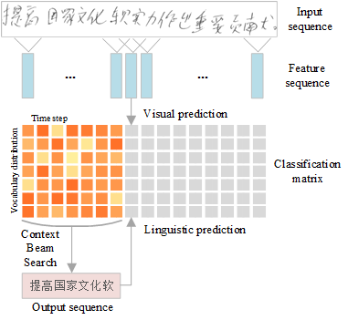
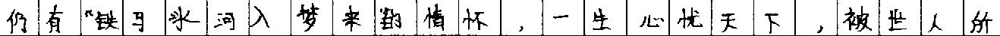
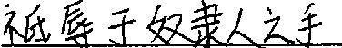
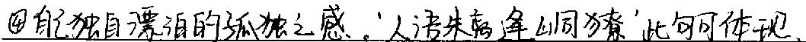
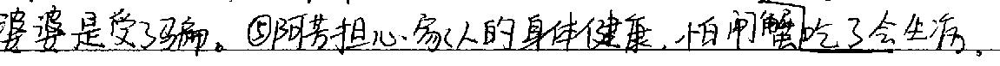
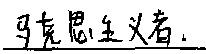

# Handwritten-Chinese-OCR

## Summary
This project aims to create a simple and unified handwritten text-line recognition reference solution using CNN-only and CTC method with PyTorch framework and Intel OpenVINO toolkit. And it is also the source of multiple previous works including:

* [Offline Handwritten Chinese Text Recognition with Convolutional Neural Networks (arXiv 2020)](https://arxiv.org/abs/2006.15619)
* Searching from the prediction of visual and language model for Handwritten Chinese Text Recognition (ICDAR 2021)
* [OpenVINO Open Model Zoo: handwritten-simplified-chinese-recognition-0001](https://github.com/openvinotoolkit/open_model_zoo/tree/master/models/intel/handwritten-simplified-chinese-recognition-0001)

The overview of our method to predict and decode the result with visual and language model.



Comparison with recent works on the [ICDAR 2013 competition](https://ieeexplore.ieee.org/document/6628856) set in the metric of character error rate (100% - AR).

| Methods | without language model | with language model |
| --- | :---: | :---: |
| [LSTM-RNN-CTC](https://ieeexplore.ieee.org/document/7333746) | 16.50 | 11.60 |
| [Over-segmentation](https://dl.acm.org/doi/abs/10.1016/j.patcog.2016.12.026) | - | 3.68 |
| [CNN-ResLSTM-CTC](https://link.springer.com/chapter/10.1007/978-3-030-57058-3_4)| 8.45 | 3.28 |
| [WCNN-PHMM](https://arxiv.org/abs/1812.09809) | 8.42 | 3.17 |
| CNN-CTC-CBS (this) | 6.38 | 2.49 |


## Part I: Start from the pre-trained models with Intel OpenVINO toolkit

### Installation
* [Anaconda](https://www.anaconda.com/distribution/) with Python 3.7 or above (recommended)
* Intel [OpenVINO](https://docs.openvinotoolkit.org/latest/index.html) toolkit with version 2021.3 or above

### Inference
Download the models trained with [SCUT-EPT](https://github.com/HCIILAB/SCUT-EPT_Dataset_Release) dataset with Open Model Zoo downloader tool.
```
python <your-openvino-installation>/deployment_tools/open_model_zoo/tools/downloader/downloader.py \
       --name handwritten-simplified-chinese-recognition-0001
```
Run inference with the SCUT-EPT test image as input and check the prediction.
```
# use character list for SCUT-EPT data instead
# https://github.com/openvinotoolkit/open_model_zoo/blob/master/data/dataset_classes/scut_ept.txt
# NOTE: input data was not normalized during the SCUT-EPT model training
python deploy.py -lang hctr -m <path-to-handwritten-simplified-chinese-recognition-0001.xml> \
       -dm greedy-search -i <path-to-input-image>
```
Input and output examples (NOT use language model, and only use VGG-based network for training this recognition model):



['仍有“铁马冰河入梦来”的情怀，一生心忧天']



['不祇辱于奴隶人之手']



['④自己独自漂泊的孤独之感。人语朱离逢山峒獠”此句可体现。']



['婆婆是受了马骗。⑤阿苦担心家人的身体健康，怕闸蟹吃了会生游。']



['马克思主义者．']


## Part II: Reproduce this paper work with CASIA-HWDB databases or train new models with your own data

### Installation
* [Anaconda](https://www.anaconda.com/distribution/) with Python 3.7 or above (recommended)
* [PyTorch](https://github.com/pytorch/pytorch) 1.8.1 or above
* NVIDIA CUDA 11.0 or above
* [NVIDIA Apex library](https://github.com/NVIDIA/apex)
* [PyTorch Binding for warp-ctc](http://github.com/SeanNaren/warp-ctc.git)

### Dataset and Structure
Restricted datasets for research only for different languages:
* [CASIA-HWDB](http://www.nlpr.ia.ac.cn/databases/handwriting/Home.html)
* [Kondate](http://web.tuat.ac.jp/~nakagawa/database/index.html)
* [IAM](https://fki.tic.heia-fr.ch/databases/iam-handwriting-database)

The format of train/val/test_img_id_gt.txt are designed as one sample per line, which uses a comma to separate the image and label:
```
img_id_1,text_1
img_id_2,text_2
img_id_3,text_3
...
```
The format of the chars_list.txt is designed as one character per line:
```
character_1
character_2
character_3
...
```
### Training
Note that, before training with a target dataset, all the gray-scale images should be resized to fixed-height (e.g. 128) with fixed-ratio.
```
python main.py -m hctr -d <path-to-dataset> -b 8 -pf 100 -lr 1e-4 --gpu 0 (default: multi-gpus mode)
```

### Testing
After the training, the model can then be tested with testset or single image for benchmarking. In order to get the output of CTC-based text recognition, there is one additional step called decoding which is ensential for final accuracy.
```
python test.py -m hctr -f <path-to-trained_model> \
               -i <input_image> (or -ts <path-to-testset>) \
               -dm [greedy-search|beam-search] \
               ...
```
#### Decoding with greedy-search
This is a basic and default decoding method, and it only takes the maximum probalitiy at each output step.
#### Decoding with beam-search (with language model)
To further improve the accuracy, a specific language model (n-gram or transformer-based) can be introduced to work with the beam-search decoding. There are two major strategies provided to configurate the beam-search.
* For the best accuracy, adding:
```
-dm beam-search --use-tfm-pred --transformer-path <path-to-trained-tranformer>
```
* For the shortest latency, adding:
```
-dm beam-search --skip-search --kenlm-path <path-to-trained-ngrams>
```

See the instructions under third-party folder to train a specific n-gram or transformer-based language model.

### Deploying
1. Convert the PyTorch model to onnx with export_onnx.py
2. Convert the onnx model to OpenVINO IR xml and bin (optional)
3. Inference with OpenVINO on target platform with deploy.py
4. Tune the performance with best known practises.

## License
Handwritten Chinese OCR Samples is licensed under [Apache License Version 2.0](LICENSE).

## Citation
If you find this code useful in your research, please consider citing:

    @article{bliu2020hctr-cnn,
	      Author = {Brian Liu, Xianchao Xu, Yu Zhang},
	      Title = {Offline Handwritten Chinese Text Recognition with Convolutional Neural Networks},
	      publisher  = {arXiv},
	      Year = {2020}
    }
