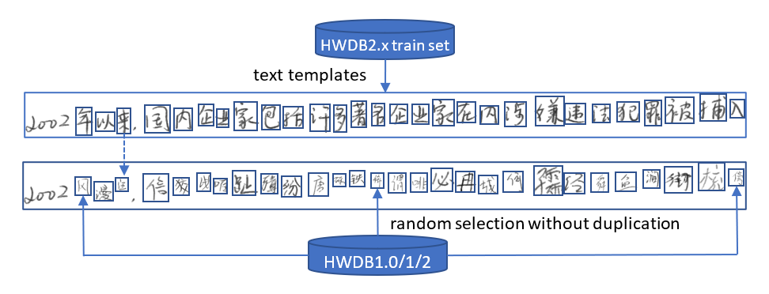

## CASIA-HWDB data preparation for model training

### 1. Databases downloading
Character Sample Data HWDB1.0-1.2, Textline Data HWDB2.0-2.2, and Competition Test Data (offline) can all be downloadable from [CASIA Online and Offline Chinese Handwriting Databases](http://www.nlpr.ia.ac.cn/databases/handwriting/Download.html).

Note that the preparation process provided here is mainly for the DGR format of HWDB2.0-2.2 and Competition Test Data, and the newly DGRL format is NOT supported yet but should be similar and ready soon.

### 2. Images and lables extraction
Isolated character sample data in GNT format can be extracted with gnt2png.py, and other text data in DGR format (previous version) can be extracted by dgr2png which is built from dgr2png.c file.

### 3. Chars list and img-gt pair generation
The characters list includes all the different characters from HWDB1.0-1.2 and HWDB2.0-2.2, and it will be used as the dictionary for model training and inference to encode and decode. This list can be automatically generated by running preparation_flow.py without "synthesize" parameter.

Along with this preparation_flow.py, the image-groundtruth pairs on character data and text(train/test) data will also be generated for later reference.

Specifically, the alphanumeric and symbol characters will be selected, which are relatively small visually coresponding to the normal Chinese characters and will NOT be replaced during the text image synthesization (see below).

### 4. Synthesize new text images with isolated character images
In order to increase the amount of data for training, all the isolated character sample data are considered. Given the existing bounding boxes around each character in the text image, the synthesization process is applied by reusing these bounding boxes and just replacing each position with a random selected character image from HWDB1.x data. In other words, this method help keeps the natural writing sytle as much as possible. Below figure illustrated this text synthesization process.

Above dgr2png executable binary will be resued to generate the synthesized data, and then call preparation_flow.py again with "synthesize" parameter to generate the additional image-groundtruth pairs for data augmentation training.
